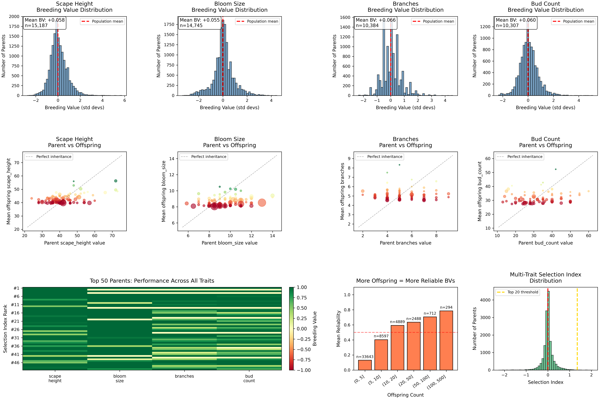
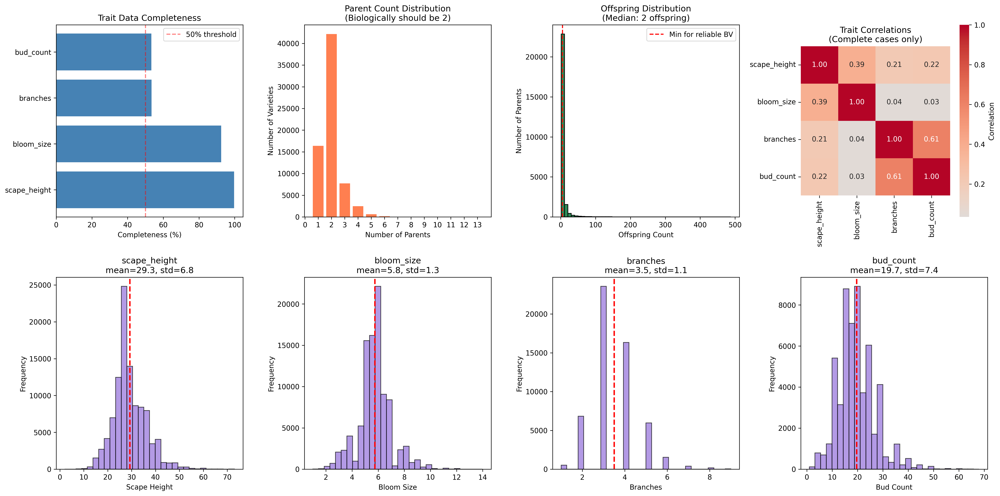

# Daylily Breeding Value Analysis

A data science portfolio project analyzing 100,000+ daylily varieties to identify which plants make the best breeding parents.



## Quick Summary

| Metric | Value |
|--------|-------|
| **Varieties Analyzed** | 101,718 |
| **Parent-Child Relationships** | 138,352 |
| **Unique Hybridizers** | 5,334 |
| **Time Span** | 1763-2024 (260 years) |
| **Predictive Accuracy (Bloom Size)** | R²=0.33, r=0.61 |

**Key Achievement**: Built a breeding value estimation system that successfully predicts offspring bloom size and scape height from parent genetics, validated on 12,800+ post-2012 varieties.

---

## The Problem

With 100,000+ registered daylily varieties, hybridizers face an overwhelming selection challenge. Most rely on intuition, aesthetics, or word-of-mouth. But which varieties *actually* produce superior offspring?

**This project answers that question with data.**

---

## What I Built

### End-to-End Data Pipeline

```
Raw Database (102K varieties)
    ↓
Data Cleaning & Validation (Notebook 01)
    ↓
Exploratory Analysis (Notebooks 02, 02.5)
    ↓
Pedigree Network Extraction (Notebook 03_0) ← Proprietary algorithm
    ↓
Network Influence Metrics (Notebook 03)
    ↓
Geographic Enrichment (Notebook 04)
    ↓
Master Database Integration (Notebook 05)
    ↓
Breeding Value Estimation & Validation (Notebook 06)
```

### Core Technical Components

| Component | Method | Key Result |
|-----------|--------|------------|
| **Data Cleaning** | IQR outlier detection, deduplication | 893 duplicates removed, 312 temporal outliers filtered |
| **Pedigree Parsing** | Custom AST algorithm | 99.95% success rate (53/101,446 failures) |
| **Network Analysis** | PageRank, betweenness, Katz centrality | 76,449 nodes, 138,352 edges mapped |
| **Breeding Values** | Offspring performance vs. population mean | 15,187 parents evaluated across 4 traits |
| **Validation** | Temporal train/test split (pre/post 2012) | Bloom size R²=0.33, height R²=0.14 |

---

## Results

### What Works: Validated Predictions

The temporal validation (train on pre-2012, test on post-2012) revealed meaningful predictive power for two traits:

| Trait | R² | Correlation | Test Samples | Verdict |
|-------|-----|-------------|--------------|---------|
| **Bloom Size** | 0.334 | 0.605 | 12,800 | Strong - use with confidence |
| **Scape Height** | 0.139 | 0.436 | 12,826 | Moderate - use as guidance |
| Branches | -0.153 | 0.123 | 11,485 | Poor - model doesn't help |
| Bud Count | -0.403 | 0.128 | 11,448 | Poor - model doesn't help |

**Interpretation**: For bloom size and height, knowing a parent's breeding value genuinely predicts offspring performance. For branches and bud count, data sparsity (53% completeness) undermines predictive power.

### Top Breeding Parents by Trait

**Bloom Size** (offspring avg vs population):
1. Linguini (+3.49 std devs, 10 offspring)
2. Donnie Joe Cole (+3.45 std devs, 16 offspring)
3. Wild and Free (+3.17 std devs, 13 offspring)

**Scape Height**:
1. Notify Ground Crew (+3.96 std devs, 17 offspring)
2. Challenger (+3.46 std devs, 9 offspring)
3. B.J. McMillen (+3.09 std devs, 20 offspring)

**Multi-Trait Improvers** (balanced index):
1. Linguini (Index +2.07)
2. Moonbeam (Index +1.91)
3. Stick Figure (Index +1.83)

### Data Quality Assessment



---

## Technical Skills Demonstrated

### Data Engineering
- Web scraping with ethical rate limiting (3-4 nights, low bandwidth)
- Deduplication and outlier detection (IQR method with domain validation)
- Multi-format export (SQLite, CSV, JSON, JSONL)
- Complex SQL joins with GROUP_CONCAT aggregations

### Statistical Analysis
- Effect size estimation (Cohen's d standardization)
- Hypothesis testing with reliability weighting
- Temporal train/test validation (avoiding data leakage)
- Correlation and distribution analysis

### Network Analysis
- Graph construction from NLP-extracted relationships
- Multiple centrality measures (PageRank, betweenness, degree, Katz)
- Large-scale graph processing (76K+ nodes)
- Export to GraphML, GEXF, Pickle formats

### Quantitative Genetics Concepts
- Breeding value = (offspring_mean - population_mean) / population_std
- Reliability scoring: statistical confidence × sample adequacy
- Multi-trait selection indices with customizable weights
- Transmitting ability concepts (TA = BV/2)

### Tools & Libraries
- **Languages**: Python, SQL
- **Data**: pandas, numpy, scipy
- **Networks**: NetworkX, igraph
- **Visualization**: matplotlib, seaborn
- **Database**: SQLite3
- **Environment**: Jupyter notebooks

---

## Project Structure

```
A1_DataSci_Portfolio/
├── Notebooks (Runnable Pipeline)
│   ├── 01_data_exploration.ipynb      # EDA, cleaning, validation
│   ├── 02_hybridizer_analysis.ipynb   # Career trajectories, community trends
│   ├── 02_5_variety_exploration.ipynb # Trait trends over time
│   ├── 03_0_network_extraction.ipynb  # Pedigree parsing (simplified)
│   ├── 03_network_analysis.ipynb      # Centrality metrics, influence
│   ├── 04_regional_data.ipynb         # Geographic enrichment
│   ├── 05_merge.ipynb                 # Master database creation
│   └── 06_breeding_values.ipynb       # Core analysis & validation
│
├── Data Files
│   ├── daylilies.db                   # SQLite database (138 MB)
│   ├── daylilies.jsonl                # Raw scraped data (60 MB)
│   └── data/
│       ├── master_daylily.csv         # Integrated dataset (48 MB)
│       ├── daylily_parent_child_network.csv
│       └── breeding_values_*.csv      # Per-trait results
│
├── Outputs
│   ├── breeding_value_analysis_results.png
│   ├── data_quality_dashboard.png
│   └── selection_index_*.csv          # Multi-trait rankings
│
└── Documentation
    ├── README.md
    └── requirements.txt
```

---

## Limitations & Honest Assessment

### What's Not Included (IP Considerations)

**Pedigree Parsing Algorithm**: Notebook `03_0_network_extraction.ipynb` contains a simplified version. The full AST-based parser that achieves 99.95% accuracy on complex nested pedigrees like `((A × B) × C) × (D × E)` is proprietary. The algorithm:
- Handles 13,042 "unknown" entries with unique identity assignment
- Resolves 26,858 "seedling" entries to prevent network collapse
- Differentiates maternal/paternal parent roles

**Raw Data Sources**: Original scraped database and some intermediate files excluded to respect data provenance considerations.

*Full implementation available to potential employers upon request during interview processes.*

### Data Quality Constraints

| Issue | Impact | Mitigation |
|-------|--------|------------|
| **11% of varieties show 3+ parents** | NLP extraction artifacts (biologically impossible) | Evaluate parents on ALL offspring; noise averages out |
| **Branches/bud count 53% complete** | Insufficient data for reliable predictions | Focus guidance on bloom size and height |
| **Registration bias** | Only top 1-5% of seedlings registered | Use for relative ranking, not absolute prediction |
| **No controlled experiments** | Observational data with confounds | Validated with temporal split; acknowledge uncertainty |

### Model Limitations

- **Assumes linear trait inheritance**: Real genetics involves dominance, epistasis, and gene interactions
- **Partner effects averaged out**: Measures general combining ability, not specific cross performance
- **Historical vs. modern contexts**: Breeding practices and trait preferences have shifted over 260 years

### Why Branches/Bud Count Failed

The negative R² for these traits means the model performs *worse than predicting the mean*. Likely causes:
1. **Data sparsity**: Only 53% of varieties have these traits recorded
2. **Fewer parents with 10+ measured offspring**: Limits reliable BV estimation
3. **Possibly more complex inheritance**: May require different modeling approaches

---

## Methodology Deep Dive

### Breeding Value Calculation

```python
Breeding Value = (mean_offspring - population_mean) / population_std
```

This gives a standardized effect size (like Cohen's d). A BV of +0.5 means offspring average 0.5 standard deviations above population mean.

### Reliability Scoring

Not all breeding values are equally trustworthy:

```python
reliability = statistical_confidence × sample_adequacy
           = (1 - min(p_value, 0.5) × 2) × min(1, n_offspring/10)
```

- **Small samples** → lower reliability
- **High p-values** → lower reliability
- **n≥10 with p<0.05** → reliability approaches 1.0

### Weighted Breeding Value

```python
weighted_bv = breeding_value × reliability
```

This automatically downweights uncertain estimates in rankings.

### Temporal Validation Strategy

To test real-world predictive power:
1. Calculate breeding values using only pre-2012 data
2. For each post-2012 variety, predict trait from parent BVs
3. Compare predictions to actual registered values
4. Report R², correlation, MAE

This simulates what happens when a breeder uses historical data to make decisions today.

---

## Key Findings

### Network Insights

- **Most influential historical parent**: Frances Fay (1957) with 32,839 total descendants
- **Most prolific modern parent**: Ed Brown with 488 direct children
- **Network density**: 0.000024 (sparse, confirming strategic rather than random breeding)

### Community Trends

- **Peak growth era**: 2000s with 1,141 new hybridizers entering
- **Current decline**: Net loss of 597 hybridizers in 2020s (1,067 exits vs 470 entries)
- **Productivity gains**: Modern hybridizers show 22-24% higher output than historical cohorts
- **Elite concentration**: Only 4.1% of hybridizers (219 individuals) have registered 100+ varieties

### Trait Evolution (1950-2024)

- **Tetraploid prevalence**: Rose from ~20% (1960) to ~60-70% (2024)
- **Rebloom prevalence**: Increased from ~30% (1980s) to ~45-50% (2024)
- **Bloom size**: Slight upward trend over decades

---

## Recommendations

### For Breeders Using This Data

1. **Prioritize bloom size and height selections** - these traits have validated predictive power
2. **Look for reliability > 0.6** - parents with 10+ measured offspring
3. **Consider multi-trait improvers** - rare but valuable (Linguini, Moonbeam, Stick Figure)
4. **Validate with test crosses** - do 1-2 crosses before committing heavily
5. **Treat as relative ranking** - not absolute prediction

### For Hiring Managers Reviewing This Portfolio

This project demonstrates:
- **End-to-end pipeline development** from raw data to validated predictions
- **Honest uncertainty quantification** - reliability scoring, validation, transparent limitations
- **Domain expertise integration** - genetics concepts applied to practical breeding tools
- **Production-quality code** - 10-minute runtime on laptop, modular functions, clear documentation
- **Scientific rigor** - temporal validation, effect sizes, statistical significance

---

## Getting Started

### Prerequisites
- Python 3.8+
- Jupyter Notebook/Lab

### Installation

```bash
git clone https://github.com/drowsy-1/Daylily-Analytics.git
cd Daylily-Analytics
python -m venv venv
source venv/bin/activate  # Windows: venv\Scripts\activate
pip install -r requirements.txt
jupyter notebook
```

### Notebook Execution Order

Run notebooks 01-05 sequentially to build the pipeline. Notebook 06 (breeding values) can run independently if data files are present.

**Note**: Notebook 03_0 contains a simplified pedigree extraction. Full implementation available upon request.

---

## Future Directions

- **Ploidy stratification**: Diploid and tetraploid inheritance patterns differ
- **A-matrix implementation**: Additive relationship matrix for genetic covariance
- **Interactive dashboard**: Let breeders explore data themselves
- **Genomic selection**: If SNP data becomes available, GBLUP methods could improve accuracy

---

## Contact

**Author**: Trinity Love
**LinkedIn**: [linkedin.com/in/trinity-love-a551011b3](https://www.linkedin.com/in/trinity-love-a551011b3)
**Repository**: [github.com/drowsy-1/Daylily-Analytics](https://github.com/drowsy-1/Daylily-Analytics)

*Full codebase including proprietary components available to potential employers upon request.*

---

## Acknowledgments

- American Daylily Society for maintaining the variety database
- The daylily breeding community for decades of meticulous record-keeping
